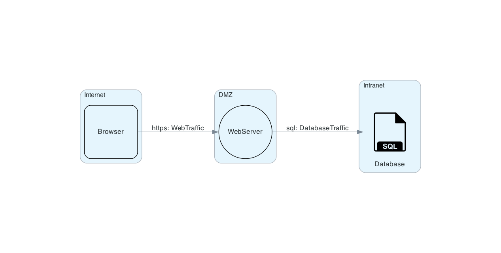

# REST API Model
> 

## Data-Flow Diagram

## Potential Risks
|ID|Risk|
|---|---|
|[CAPEC-63@WebServer](#capec-63webserver)|Cross-Site Scripting (XSS) risk at WebServer|
|[CAPEC-66@WebServer@DatabaseTraffic](#capec-66webserverdatabasetraffic)|SQL Injection risk at WebServer against database Database via DatabaseTraffic|

## User Stories
|ID|User Story|
|---|---|
|[ASVS-5.1.3@CAPEC-63@WebServer](#asvs-513capec-63webserver)|As a Security Champion I want all of the input which can affect control or data flow to be validated so that I can protect my application from malicious manipulation which could lead to unauthorised disclosure or loss of integrity.|
|[ASVS-5.3.3@CAPEC-63@WebServer](#asvs-533capec-63webserver)|As a Security Champion I want all of the output to be escaped so that I can protect my application against reflected, stored, and DOM based XSS.|
|[ASVS-5.3.4@CAPEC-66@WebServer@DatabaseTraffic](#asvs-534capec-66webserverdatabasetraffic)|As a Security Champion I want all data selection or database queries use parameterized queries so that my application is protected against database injection attacks.|

## Risk Details
### CAPEC-63@WebServer
An adversary embeds malicious scripts in content that will be served to web browsers. The goal of the attack is for the target software, the client-side browser, to execute the script with the users' privilege level. An attack of this type exploits a programs' vulnerabilities that are brought on by allowing remote hosts to execute code and scripts. Web browsers, for example, have some simple security controls in place, but if a remote attacker is allowed to execute scripts (through injecting them in to user-generated content like bulletin boards) then these controls may be bypassed. Further, these attacks are very difficult for an end user to detect.

**Prerequisites**:
- Target client software must be a client that allows scripting communication from remote hosts, such as a JavaScript-enabled Web Browser.

**Risk**:\
⚠ Cross-Site Scripting (XSS) risk at WebServer

**Mitigations**:
- Output Escaping: [ASVS-5.3.3@CAPEC-63@WebServer](#asvs-533capec-63webserver)
- Proper Input Validation: [ASVS-5.1.3@CAPEC-63@WebServer](#asvs-513capec-63webserver)

**References**:
- https://capec.mitre.org/data/definitions/63.html
- https://cwe.mitre.org/data/definitions/79.html
- https://cwe.mitre.org/data/definitions/20.html

---
### CAPEC-66@WebServer@DatabaseTraffic
This attack exploits target software that constructs SQL statements based on user input. An attacker crafts input strings so that when the target software constructs SQL statements based on the input, the resulting SQL statement performs actions other than those the application intended. SQL Injection results from failure of the application to appropriately validate input.

**Prerequisites**:
- SQL queries used by the application to store, retrieve or modify data.
- User-controllable input that is not properly validated by the application as part of SQL queries.

**Risk**:\
⚠ SQL Injection risk at WebServer against database Database via DatabaseTraffic

**Mitigations**:
- Parameterized Queries: [ASVS-5.3.4@CAPEC-66@WebServer@DatabaseTraffic](#asvs-534capec-66webserverdatabasetraffic)

**References**:
- https://capec.mitre.org/data/definitions/66.html
- https://cwe.mitre.org/data/definitions/89.html
- https://cwe.mitre.org/data/definitions/1286.html

---

## User Story Details
### ASVS-5.1.3@CAPEC-63@WebServer
Verify that all input (HTML form fields, REST requests, URL parameters, HTTP headers, cookies, batch files, RSS feeds, etc) is validated using positive validation (allow lists).

#### User Story
**Feature Name**: Proper Input Validation

**Story**:\
As a Security Champion I want all of the input which can affect control or data flow to be validated so that I can protect my application from malicious manipulation which could lead to unauthorised disclosure or loss of integrity.

**References**:
- https://cheatsheetseries.owasp.org/cheatsheets/Input_Validation_Cheat_Sheet.html
- https://cwe.mitre.org/data/definitions/20.html

---
### ASVS-5.3.3@CAPEC-63@WebServer
Verify that context-aware, preferably automated - or at worst, manual - output escaping protects against reflected, stored, and DOM based XSS

#### User Story
**Feature Name**: Output Escaping

**Story**:\
As a Security Champion I want all of the output to be escaped so that I can protect my application against reflected, stored, and DOM based XSS.

**References**:
- https://cheatsheetseries.owasp.org/cheatsheets/Cross_Site_Scripting_Prevention_Cheat_Sheet.html
- https://cwe.mitre.org/data/definitions/79.html

---
### ASVS-5.3.4@CAPEC-66@WebServer@DatabaseTraffic
Verify that data selection or database queries (e.g. SQL, HQL, ORM, NoSQL) use parameterized queries, ORMs, entity frameworks, or are otherwise protected from database injection attacks.

#### User Story
**Feature Name**: Parameterized Queries

**Story**:\
As a Security Champion I want all data selection or database queries use parameterized queries so that my application is protected against database injection attacks.

**References**:
- https://cheatsheetseries.owasp.org/cheatsheets/SQL_Injection_Prevention_Cheat_Sheet.html
- https://cwe.mitre.org/data/definitions/89.html

---
